# AWS 서버리스 배포 실습 — Node.js · Python · Java + API Gateway

> **Hands-on AWS serverless examples with Lambda, API Gateway, CI/CD, and AI service integrations in Node.js, Python, and Java**

> **AWS Lambda와 Amazon API Gateway를 활용한 서버리스 함수 배포 실습 레포**
> Node.js, Python, Java 세 가지 런타임으로 Lambda 함수를 작성하고,
> AWS 콘솔 · AWS CLI · Serverless Framework · GitHub Actions CI/CD 네 가지 방법으로 배포하는 전 과정을 다룹니다.

[](LICENSE)
[](nodejs/)
[](python/)
[](java/)
[](https://www.serverless.com/)
[](https://aws.amazon.com/lambda/)
[](https://github.com/features/actions)

---

## 목차

1. [기술 스택](#기술-스택)
2. [아키텍처](#아키텍처)
   - [주가 데이터 AI/ML 파이프라인](#주가-데이터-aiml-파이프라인-stock-pipeline)
   - [API Gateway + Lambda](#api-gateway--lambda-hello-api)
   - [S3 이벤트 트리거 + Lambda](#s3-이벤트-트리거--lambda)
   - [GitHub Actions 배포 파이프라인](#github-actions-배포-파이프라인)
3. [디렉터리 구조](#디렉터리-구조)
4. [사전 준비](#사전-준비)
5. [AWS CLI 설치 및 설정](#aws-cli-설치-및-설정)
6. [AWS Lambda 이해](#aws-lambda-이해)
7. [Node.js Lambda 배포](#nodejs-lambda-배포)
8. [Python Lambda 배포](#python-lambda-배포)
9. [Java Lambda 배포](#java-lambda-배포)
10. [API Gateway 연동](#api-gateway-연동)
11. [GitHub Actions CI/CD 자동 배포](#github-actions-cicd-자동-배포)
12. [권한 오류 해결 가이드](#권한-오류-해결-가이드)
13. [AWS CLI 명령어 모음](#aws-cli-명령어-모음)
14. [추가 실습](#추가-실습)

---

## 기술 스택

### 런타임 및 언어

| 언어    | 버전     | Lambda 런타임 식별자 | 핸들러 진입점                |
| ------- | -------- | -------------------- | ---------------------------- |
| Node.js | 20.x     | `nodejs20.x`       | `index.handler`            |
| Python  | 3.12     | `python3.12`       | `handler.hello`            |
| Java    | 17 (LTS) | `java17`           | `com.example.HelloHandler` |

### AWS 서비스

| 서비스                           | 역할                                                                        |
| -------------------------------- | --------------------------------------------------------------------------- |
| **AWS Lambda**             | 서버리스 함수 실행 환경. 요청 시에만 컨테이너를 띄워 코드를 실행하고 과금   |
| **Amazon API Gateway**     | HTTP 요청을 Lambda로 라우팅하는 관리형 API 엔드포인트 (REST API / HTTP API) |
| **Amazon S3**              | 객체 스토리지. Lambda의 이벤트 트리거 소스로도 활용                         |
| **Amazon CloudWatch Logs** | Lambda 실행 로그 자동 수집 및 조회                                          |
| **AWS IAM**                | Lambda 실행 역할, 사용자 권한 정책 관리                                     |
| **AWS CloudFormation**     | Serverless Framework 배포 시 내부적으로 사용하는 인프라 프로비저닝 엔진     |

### 배포 도구

| 도구                           | 버전 | 용도                                                                                  |
| ------------------------------ | ---- | ------------------------------------------------------------------------------------- |
| **AWS CLI**              | v2   | Lambda 함수 생성·업데이트·호출, API Gateway 설정 등 모든 AWS 작업을 터미널에서 수행 |
| **Serverless Framework** | 3.x  | `serverless.yaml` 하나로 Lambda + API Gateway + IAM 역할을 자동 생성·배포          |
| **GitHub Actions**       | —   | `main` 브랜치 push 시 변경된 언어 디렉터리만 자동 감지하여 Lambda에 배포            |
| **Apache Maven**         | 3.8+ | Java 빌드 및 의존성 관리.`maven-shade-plugin`으로 Lambda용 Fat JAR 생성             |

### AWS SDK

| SDK                    | 버전                        | 언어    | 용도                                                             |
| ---------------------- | --------------------------- | ------- | ---------------------------------------------------------------- |
| AWS SDK for JavaScript | v2 (`aws-sdk`)            | Node.js | S3 업로드 스크립트 (`upload.js`) — 유지보수 모드              |
| AWS SDK for JavaScript | v3 (`@aws-sdk/client-s3`) | Node.js | S3 업로드 스크립트 (`upload2.js`, `upload3.js`) — 권장 버전 |
| Boto3                  | 최신                        | Python  | S3 이벤트 트리거 Lambda 내부에서 S3 객체 읽기                    |
| AWS Lambda Java Core   | 1.2.3                       | Java    | `RequestHandler` 인터페이스 및 `Context` 제공                |
| AWS Lambda Java Events | 3.11.4                      | Java    | `APIGatewayProxyRequestEvent` 등 API GW 이벤트 타입 제공       |

### CI/CD 파이프라인 구성 요소

| 구성 요소                                    | 역할                                                  |
| -------------------------------------------- | ----------------------------------------------------- |
| `aws-actions/configure-aws-credentials@v4` | GitHub Actions 실행기에 AWS 자격 증명을 안전하게 주입 |
| `actions/setup-java@v4`                    | Java 빌드 환경 세팅 (Temurin JDK 17, Maven 캐시)      |
| `git diff --name-only`                     | 변경된 파일 목록으로 배포 대상 디렉터리 감지          |
| `aws lambda update-function-code`          | ZIP 또는 JAR를 Lambda에 업로드                        |
| `aws lambda wait function-updated`         | 배포 완료까지 대기 (최대 5분)                         |

---

## 아키텍처

### API Gateway + Lambda (Hello API)

```
클라이언트 (브라우저 / curl / Postman)
        │
        │  HTTP GET /hello?name=Alice
        ▼
┌────────────────────────────────────┐
│         Amazon API Gateway         │
│  REST API  ·  스테이지: dev        │
│  리소스: /hello  ·  메서드: GET    │
│  통합 유형: Lambda Proxy           │
└──────────────────┬─────────────────┘
                   │  event 객체 전달
                   ▼
┌────────────────────────────────────┐
│           AWS Lambda               │
│  런타임: Node.js / Python / Java   │
│  핸들러: index.handler 등          │
│  메모리: 128 MB (Java: 512 MB)     │
│  타임아웃: 3 s (Java: 15 s)        │
└──────────┬─────────────────────────┘
           │  로그 자동 전송
           ▼
┌────────────────────────────────────┐
│       Amazon CloudWatch Logs       │
│  로그 그룹: /aws/lambda/<함수명>    │
└────────────────────────────────────┘
```

### S3 이벤트 트리거 + Lambda

```
사용자
  │  aws s3 cp face1.png s3://edumgt-bucket-logs/
  ▼
┌──────────────────┐     ObjectCreated 이벤트
│    Amazon S3     │ ──────────────────────────▶ ┌──────────────────┐
│  edumgt-bucket-  │                             │   AWS Lambda     │
│  logs            │                             │  s3-event-logger │
└──────────────────┘                             └────────┬─────────┘
                                                          │  로그 기록
                                                          ▼
                                                 ┌──────────────────┐
                                                 │  CloudWatch Logs │
                                                 └──────────────────┘
```

### 주가 데이터 AI/ML 파이프라인 (Stock Pipeline)

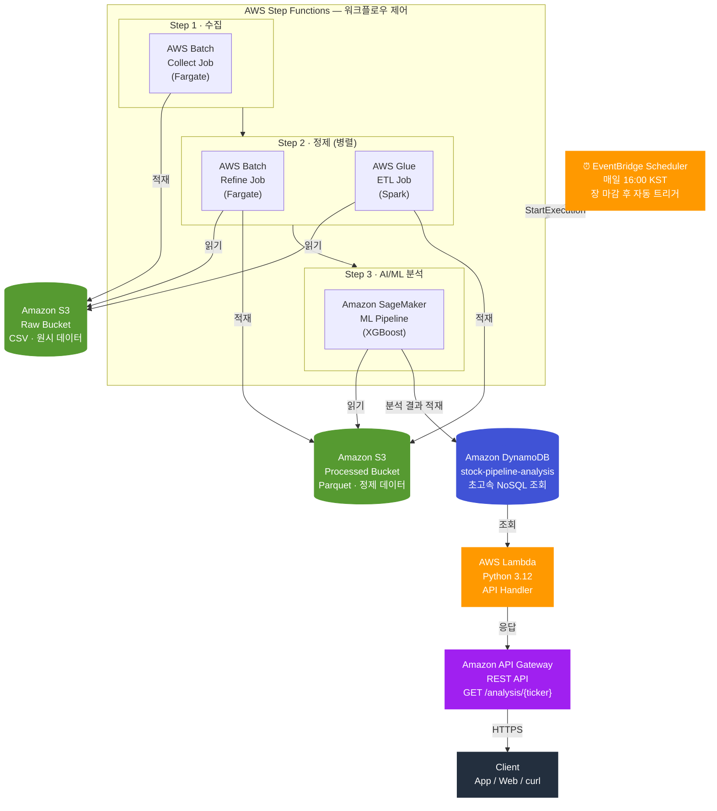

#### 데이터 흐름 요약

| 단계        | 서비스                | 입력                | 출력                                  |
| ----------- | --------------------- | ------------------- | ------------------------------------- |
| 트리거      | EventBridge Scheduler | 매일 16:00 KST 크론 | Step Functions 실행                   |
| Step 1 수집 | AWS Batch (Fargate)   | 외부 주가 API       | S3 Raw (CSV)                          |
| Step 2 정제 | AWS Batch + Glue ETL  | S3 Raw              | S3 Processed (Parquet, 이동평균 포함) |
| Step 3 분석 | SageMaker Pipeline    | S3 Processed        | DynamoDB (ML 분석 결과)               |
| API 제공    | Lambda + API Gateway  | DynamoDB 조회       | HTTPS JSON 응답                       |

#### Scripts 구성

```
scripts/
├── 00_config.sh          # 공통 환경변수 및 유틸 함수
├── 01_iam.sh             # IAM 역할·정책 생성
├── 02_s3.sh              # S3 버킷 (Raw / Processed / Scripts)
├── 03_dynamodb.sh        # DynamoDB 테이블 + GSI + TTL
├── 04_batch.sh           # Batch 컴퓨팅 환경·작업 대기열·작업 정의
├── 05_glue.sh            # Glue ETL Job (PySpark)
├── 06_sagemaker.sh       # SageMaker Pipeline
├── 07_lambda_apigw.sh    # Lambda 함수 + API Gateway
├── 08_stepfunctions.sh   # Step Functions 상태 머신
├── 09_eventbridge.sh     # EventBridge 스케줄러
├── deploy_all.sh         # 전체 배포 (순서대로 실행)
├── destroy_all.sh        # 전체 삭제 (역순)
├── lambda/
│   └── handler.py        # Lambda API 핸들러 소스
└── step-functions/
    └── workflow.json     # Step Functions 상태 머신 정의 템플릿
```

**전체 배포:**

```bash
# 기본 (dev 환경)
./scripts/deploy_all.sh

# prod 환경
ENV=prod ./scripts/deploy_all.sh prod
```

---

### GitHub Actions 배포 파이프라인

```
git push → main
     │
     ▼
┌─────────────────────────────────────────────────────┐
│               GitHub Actions                        │
│                                                     │
│  [detect-changes]                                   │
│   git diff HEAD~1 HEAD                              │
│   nodejs/ 변경? → nodejs=true/false                 │
│   python/ 변경? → python=true/false                 │
│   java/   변경? → java=true/false                   │
│       │                                             │
│       ├── nodejs=true ──▶ [deploy-nodejs]           │
│       │                    zip → update-function-code│
│       │                    wait function-updated     │
│       │                                             │
│       ├── python=true ──▶ [deploy-python]           │
│       │                    zip → update-function-code│
│       │                    wait function-updated     │
│       │                                             │
│       └── java=true   ──▶ [deploy-java]             │
│                            mvn package              │
│                            update-function-code     │
│                            wait function-updated    │
└─────────────────────────────────────────────────────┘
     │ (각 잡 병렬 실행)
     ▼
AWS Lambda 함수 코드 업데이트 완료
```

---

## 디렉터리 구조

```
aws-serverless/
├── .github/
│   └── workflows/
│       └── deploy-lambda.yml    # GitHub Actions CI/CD 워크플로
│
├── nodejs/                      # Node.js Lambda 실습
│   ├── handler.js               # Serverless Framework용 핸들러
│   ├── index.js                 # AWS CLI 배포용 핸들러
│   ├── serverless.yaml          # Serverless Framework 설정 (API GW 자동 생성)
│   ├── package.json
│   └── lambda-s3/               # S3 이벤트 트리거 실습
│       ├── index.js             # S3 이벤트 Lambda 핸들러 (Node.js, SDK v2)
│       ├── test.py              # S3 이벤트 Lambda 핸들러 (Python, Boto3)
│       ├── upload.js            # S3 파일 업로드 — AWS SDK v2
│       ├── upload2.js           # S3 파일 업로드 — AWS SDK v3
│       ├── upload3.js           # S3 파일 업로드 — AWS SDK v3 (dotenv 미사용)
│       ├── lamdatest.js         # Lambda 로컬 실행 테스트 유틸
│       ├── trust.json           # IAM 신뢰 정책 (lambda.amazonaws.com)
│       ├── s3log.json           # IAM 권한 정책 (S3 GetObject + CloudWatch Logs)
│       ├── snsnoti.json         # S3 버킷 이벤트 알림 구성
│       ├── s3-event.json        # Lambda 테스트용 S3 이벤트 페이로드
│       ├── response.json        # aws lambda invoke 결과 저장 파일
│       ├── sample.json          # 샘플 테스트 데이터
│       └── face1-4.png          # S3 업로드 테스트용 이미지
│
├── python/                      # Python Lambda 실습
│   ├── handler.py               # 기본 Hello Lambda 핸들러
│   ├── ai_handler.py            # Amazon Comprehend / Rekognition 연동 예제
│   ├── events/
│   │   ├── ai-text-event.json   # 텍스트 AI 분석 테스트 이벤트
│   │   └── ai-image-event.json  # 이미지 레이블 분석 테스트 이벤트
│   └── serverless.yaml          # Serverless Framework 설정
│
├── java/                        # Java Lambda 실습
│   ├── pom.xml                  # Maven 빌드 설정 (maven-shade-plugin으로 Fat JAR)
│   ├── serverless.yaml          # Serverless Framework 설정
│   └── src/main/java/com/example/
│       └── HelloHandler.java    # RequestHandler 구현체
│
└── docs/
    ├── images/                  # 메인 README 스크린샷 (콘솔 가이드)
    └── lambda-s3/
        └── README.md            # Lambda + S3 이벤트 트리거 실습 가이드
```

---

## 사전 준비

| 도구                 | 버전 | 설치 방법                                    |
| -------------------- | ---- | -------------------------------------------- |
| AWS 계정             | —   | [무료 가입](https://aws.amazon.com/free/)     |
| AWS CLI              | v2   | [아래 설치 가이드](#aws-cli-설치-및-설정)     |
| Node.js              | 18+  | [nodejs.org](https://nodejs.org/)             |
| Python               | 3.12 | [python.org](https://www.python.org/)         |
| Java (JDK)           | 17   | [adoptium.net](https://adoptium.net/)         |
| Maven                | 3.8+ | [maven.apache.org](https://maven.apache.org/) |
| Serverless Framework | 3.x  | `npm install -g serverless@3`              |

---

## AWS CLI 설치 및 설정

### 설치

**macOS / Linux**

```bash
curl "https://awscli.amazonaws.com/awscli-exe-linux-x86_64.zip" -o "awscliv2.zip"
unzip awscliv2.zip
sudo ./aws/install
aws --version
```

**Windows (PowerShell)**

```powershell
msiexec.exe /i https://awscli.amazonaws.com/AWSCLIV2.msi
aws --version
```

### 자격 증명 설정

```bash
aws configure
# AWS Access Key ID     [None]: <YOUR_ACCESS_KEY>
# AWS Secret Access Key [None]: <YOUR_SECRET_KEY>
# Default region name   [None]: ap-northeast-2
# Default output format [None]: json
```

설정 파일은 `~/.aws/credentials`와 `~/.aws/config`에 저장됩니다.

> **보안 팁:** 장기 자격 증명(Access Key) 대신 IAM Identity Center(SSO) 또는 EC2 인스턴스 역할을 권장합니다.

### 설정 확인

```bash
aws sts get-caller-identity
# {
#   "UserId": "AIDAXXXXXXXXXX",
#   "Account": "123456789012",
#   "Arn": "arn:aws:iam::123456789012:user/your-user"
# }
```

---

## AWS Lambda 이해

### Lambda란?

AWS Lambda는 **서버를 직접 관리하지 않고 코드를 실행**할 수 있는 이벤트 기반 컴퓨팅 서비스입니다.
함수 코드(ZIP 또는 JAR)를 업로드하면 AWS가 실행 환경 전체를 관리합니다.

| 항목      | 전통적인 서버 (EC2)              | AWS Lambda                |
| --------- | -------------------------------- | ------------------------- |
| 서버 관리 | OS 패치, 프로세스 관리 직접 수행 | AWS가 전부 관리           |
| 비용      | 미사용 시간도 과금               | 실행된 시간(ms)만 과금    |
| 확장      | Auto Scaling 직접 설정           | 요청량에 따라 자동 확장   |
| 배포      | ssh + git pull + 재시작          | ZIP 업로드 또는 CLI 한 줄 |
| 유지보수  | 직접 책임                        | 런타임 업데이트만 신경    |

### 핸들러 함수 구조

Lambda는 **이벤트(event)**와 **컨텍스트(context)**를 인자로 받는 함수를 진입점으로 사용합니다.

**Node.js**

```javascript
exports.handler = async (event, context) => {
  // event: 트리거 소스(API GW, S3 등)에서 전달된 데이터
  // context: 함수 이름, 남은 실행 시간, 로그 스트림 이름 등 런타임 정보
  return {
    statusCode: 200,
    body: JSON.stringify({ message: "Hello" }),
  };
};
```

**Python**

```python
def hello(event, context):
    # event: dict 타입, context: LambdaContext 객체
    return {
        "statusCode": 200,
        "body": json.dumps({"message": "Hello"})
    }
```

**Java**

```java
// RequestHandler<입력타입, 출력타입> 인터페이스 구현
public class HelloHandler
        implements RequestHandler<APIGatewayProxyRequestEvent, APIGatewayProxyResponseEvent> {
    @Override
    public APIGatewayProxyResponseEvent handleRequest(
            APIGatewayProxyRequestEvent input, Context context) {
        // input: API Gateway 요청 객체, context: 런타임 정보
        return new APIGatewayProxyResponseEvent().withStatusCode(200).withBody("Hello");
    }
}
```

### 이벤트(event) 객체 구조

API Gateway를 통해 Lambda가 호출될 때 전달되는 `event` 객체 예시:

```json
{
  "httpMethod": "GET",
  "path": "/hello",
  "queryStringParameters": { "name": "Alice" },
  "headers": { "Accept": "application/json" },
  "body": null,
  "isBase64Encoded": false
}
```

S3 이벤트로 호출될 때:

```json
{
  "Records": [{
    "eventSource": "aws:s3",
    "eventName": "ObjectCreated:Put",
    "s3": {
      "bucket": { "name": "edumgt-bucket-logs" },
      "object": { "key": "face1.png", "size": 12345 }
    }
  }]
}
```

### 응답(response) 객체 구조

API Gateway 프록시 통합 사용 시 반드시 아래 형식으로 응답해야 합니다:

```json
{
  "statusCode": 200,
  "headers": { "Content-Type": "application/json" },
  "body": "{\"message\": \"Hello, Alice!\"}"
}
```

> `body`는 반드시 **문자열**이어야 합니다. `JSON.stringify()` 또는 `json.dumps()`로 직렬화하세요.

### 실행 모델: 콜드 스타트 vs 웜 스타트

```
첫 번째 요청 (콜드 스타트)
  컨테이너 생성 → 런타임 초기화 → 핸들러 코드 로드 → 함수 실행
  소요 시간: 수백 ms ~ 수 초 (Java는 특히 길 수 있음)

이후 요청 (웜 스타트)
  기존 컨테이너 재사용 → 함수 실행만 수행
  소요 시간: 수 ms 수준
```

콜드 스타트 최소화 방법:

- Java: 메모리를 512 MB 이상으로 설정
- Node.js / Python: 핸들러 외부에서 무거운 초기화 코드 실행 (컨테이너 재사용 시 재실행 안 됨)
- Lambda SnapStart (Java 21+) 사용

### 주요 제한 사항

| 항목                         | 제한                                  |
| ---------------------------- | ------------------------------------- |
| 함수 코드 패키지 크기 (압축) | 50 MB (직접 업로드), 250 MB (S3 경유) |
| 최대 실행 시간               | 15분                                  |
| 메모리                       | 128 MB ~ 10,240 MB                    |
| 동시 실행 수                 | 기본 1,000 (리전별, 증설 가능)        |
| 환경 변수                    | 최대 4 KB                             |
| `/tmp` 임시 저장소         | 최대 10,240 MB                        |

### IAM 실행 역할

Lambda 함수는 실행 시 **IAM 역할(Execution Role)**을 통해 다른 AWS 서비스에 접근합니다.

```json
{
  "Version": "2012-10-17",
  "Statement": [
    {
      "Effect": "Allow",
      "Principal": { "Service": "lambda.amazonaws.com" },
      "Action": "sts:AssumeRole"
    }
  ]
}
```

필요한 권한을 역할에 연결합니다:

- 기본 로그 기록: `AWSLambdaBasicExecutionRole`
- S3 읽기: `AmazonS3ReadOnlyAccess`
- CloudWatch 전체: `CloudWatchEventsFullAccess`

---

## Node.js Lambda 배포

### 핸들러 코드 (`nodejs/index.js`)

```javascript
exports.handler = async (event) => {
  const name = event.queryStringParameters?.name || 'World';
  return {
    statusCode: 200,
    headers: { "Content-Type": "application/json" },
    body: JSON.stringify({ message: `Hello, ${name}!` }),
  };
};
```

### Serverless Framework용 핸들러 (`nodejs/handler.js`)

```javascript
module.exports.hello = async (event) => {
  const name = event.queryStringParameters?.name || "Good Morning";
  return {
    statusCode: 200,
    body: JSON.stringify({ message: `Good Morning, ${name}` }),
  };
};
```

### 콘솔 배포 절차

1. **AWS 콘솔 → Lambda → 함수 생성** 클릭
2. **새로 작성** 선택
3. **런타임**: `Node.js 20.x`
4. 코드 탭에 위 핸들러 코드 붙여넣기
5. **배포** → **테스트** 실행


### AWS CLI 배포

**1단계 — 코드 압축**

```bash
cd nodejs

# Linux / macOS
zip function.zip index.js

# Windows PowerShell
Compress-Archive -Path index.js -DestinationPath function.zip
```

**2단계 — Lambda 함수 생성** (최초 1회)

```bash
aws lambda create-function \
  --function-name edumgt-lambda-nodejs \
  --runtime nodejs22.x \
  --role arn:aws:iam::086015456585:role/lambda-test \
  --handler index.handler \
  --zip-file fileb://function.zip \
  --region ap-northeast-2
```

**3단계 — 코드 업데이트** (이후 변경 시)

```bash
aws lambda update-function-code \
  --function-name edumgt-lambda-nodejs \
  --zip-file fileb://function.zip \
  --region ap-northeast-2
```

**4단계 — 함수 호출 테스트**

```bash
aws lambda invoke \
  --function-name edumgt-lambda-nodejs \
  --payload '{"queryStringParameters":{"name":"Alice"}}' \
  --cli-binary-format raw-in-base64-out \
  response.json
cat response.json
# {"statusCode":200,"body":"{\"message\":\"Hello, Alice!\"}"}
```

### Serverless Framework 배포

```bash
npm install -g serverless@3    # 최초 1회 설치

cd nodejs
serverless deploy              # Lambda + API Gateway 자동 생성

# 배포 후 출력 예시:
# endpoints:
#   GET - https://xxxx.execute-api.ap-northeast-2.amazonaws.com/dev/hello
# functions:
#   hello: hello-api-dev-hello

serverless remove              # 생성된 모든 리소스 삭제
```

`nodejs/serverless.yaml`:

```yaml
service: hello-api

provider:
  name: aws
  runtime: nodejs18.x
  region: ap-northeast-2

functions:
  hello:
    handler: handler.hello
    events:
      - http:
          path: hello
          method: get
```

---

## Python Lambda 배포

### 핸들러 코드 (`python/handler.py`)

```python
import json

def hello(event, context):
    query_params = event.get("queryStringParameters") or {}
    name = query_params.get("name", "World")
    body = {"message": f"Hello, {name}!", "language": "Python"}
    return {
        "statusCode": 200,
        "headers": {"Content-Type": "application/json"},
        "body": json.dumps(body),
    }
```

### 콘솔 배포 절차

1. **AWS 콘솔 → Lambda → 함수 생성**
2. **런타임**: `Python 3.12`
3. **핸들러** 설정: `handler.hello`
4. **배포** → **테스트** 이벤트:
   ```json
   { "queryStringParameters": { "name": "Alice" } }
   ```

### AWS CLI 배포

```bash
cd python
zip function.zip handler.py

# 함수 생성
aws lambda create-function \
  --function-name edumgt-lambda-python \
  --runtime python3.12 \
  --role arn:aws:iam::<ACCOUNT_ID>:role/<ROLE_NAME> \
  --handler handler.hello \
  --zip-file fileb://function.zip \
  --region ap-northeast-2

# 코드 업데이트
aws lambda update-function-code \
  --function-name edumgt-lambda-python \
  --zip-file fileb://function.zip \
  --region ap-northeast-2

# 호출 테스트
aws lambda invoke \
  --function-name edumgt-lambda-python \
  --payload '{"queryStringParameters":{"name":"Alice"}}' \
  --cli-binary-format raw-in-base64-out \
  response.json && cat response.json
```

### Serverless Framework 배포

```bash
cd python
serverless deploy
```

`python/serverless.yaml`:

```yaml
service: hello-api-python

provider:
  name: aws
  runtime: python3.12
  region: ap-northeast-2
  stage: ${opt:stage, 'dev'}
  environment:
    AI_DEFAULT_LANGUAGE: ko
  iam:
    role:
      statements:
        - Effect: Allow
          Action:
            - comprehend:DetectSentiment
            - comprehend:DetectEntities
            - comprehend:DetectPiiEntities
            - rekognition:DetectLabels
          Resource: "*"

functions:
  hello:
    handler: handler.hello
    events:
      - http:
          path: hello
          method: get
          cors: true
```

### AWS AI 리소스 연동 예제

`python/`에는 기본 Hello API 외에도 **Amazon Comprehend**와 **Amazon Rekognition**을 직접 호출하는 Python Lambda 예제가 포함되어 있습니다.

| 엔드포인트 | 연결 서비스 | 입력 | 반환 예시 |
| --- | --- | --- | --- |
| `POST /ai/text/analyze` | Amazon Comprehend | 본문 `text`, `language_code`, `detect_pii` | 감정 분석, 개체명 추출, PII 탐지 |
| `POST /ai/image/labels` | Amazon Rekognition | 본문 `s3_bucket`, `s3_key` 또는 `image_bytes_base64` | 이미지 레이블, 카테고리, 신뢰도 |

관련 파일:

- [`python/ai_handler.py`](python/ai_handler.py)
- [`python/events/ai-text-event.json`](python/events/ai-text-event.json)
- [`python/events/ai-image-event.json`](python/events/ai-image-event.json)

`python/serverless.yaml`에는 두 AI API에 필요한 IAM 권한도 함께 선언되어 있으므로, 별도 콘솔 작업 없이 `serverless deploy`로 바로 배포할 수 있습니다.

```bash
cd python
serverless deploy --stage dev
serverless info
```

배포 후 텍스트 분석 예시:

```bash
curl -X POST https://<api-id>.execute-api.ap-northeast-2.amazonaws.com/dev/ai/text/analyze \
  -H "Content-Type: application/json" \
  -d '{
    "text": "John Smith from Seattle said the Lambda rollout was smooth and shared john@example.com for follow-up.",
    "language_code": "en",
    "detect_pii": true
  }'
```

Lambda 직접 호출 예시:

```bash
aws lambda invoke \
  --function-name hello-api-python-dev-aiTextAnalyze \
  --payload fileb://events/ai-text-event.json \
  --cli-binary-format raw-in-base64-out \
  response.json && cat response.json
```

이미지 분석은 S3 객체 경로만 넘기면 됩니다:

```bash
curl -X POST https://<api-id>.execute-api.ap-northeast-2.amazonaws.com/dev/ai/image/labels \
  -H "Content-Type: application/json" \
  -d '{
    "s3_bucket": "replace-with-your-bucket",
    "s3_key": "images/sample.png",
    "max_labels": 8,
    "min_confidence": 75
  }'
```

---

## Java Lambda 배포

### 핸들러 코드 (`java/src/main/java/com/example/HelloHandler.java`)

Java Lambda는 `RequestHandler<입력, 출력>` 인터페이스를 구현합니다.
API Gateway 프록시 통합 이벤트에는 `APIGatewayProxyRequestEvent`와 `APIGatewayProxyResponseEvent`를 사용합니다.

```java
package com.example;

import com.amazonaws.services.lambda.runtime.Context;
import com.amazonaws.services.lambda.runtime.RequestHandler;
import com.amazonaws.services.lambda.runtime.events.APIGatewayProxyRequestEvent;
import com.amazonaws.services.lambda.runtime.events.APIGatewayProxyResponseEvent;
import java.util.HashMap;
import java.util.Map;

public class HelloHandler
        implements RequestHandler<APIGatewayProxyRequestEvent, APIGatewayProxyResponseEvent> {

    @Override
    public APIGatewayProxyResponseEvent handleRequest(
            APIGatewayProxyRequestEvent input, Context context) {

        Map<String, String> params = input.getQueryStringParameters();
        String name = (params != null && params.containsKey("name"))
                ? params.get("name") : "World";

        Map<String, String> headers = new HashMap<>();
        headers.put("Content-Type", "application/json");
        String body = String.format(
                "{\"message\": \"Hello, %s!\", \"language\": \"Java\"}", name);

        return new APIGatewayProxyResponseEvent()
                .withStatusCode(200)
                .withHeaders(headers)
                .withBody(body);
    }
}
```

### Maven 빌드 구조 (`java/pom.xml`)

`maven-shade-plugin`을 사용해 의존성을 모두 포함한 **Fat JAR(Uber JAR)**를 빌드합니다.
Lambda는 외부 의존성을 직접 설치할 수 없으므로, 필요한 모든 클래스를 하나의 JAR에 묶어야 합니다.

```xml
<plugin>
    <groupId>org.apache.maven.plugins</groupId>
    <artifactId>maven-shade-plugin</artifactId>
    <version>3.5.1</version>
    <executions>
        <execution>
            <phase>package</phase>
            <goals><goal>shade</goal></goals>
        </execution>
    </executions>
</plugin>
```

```bash
cd java
mvn package
# 결과물: target/hello-lambda-1.0-SNAPSHOT.jar (Fat JAR, 수 MB)
```

### 콘솔 배포 절차

1. Maven으로 JAR 빌드: `mvn package`
2. **AWS 콘솔 → Lambda → 함수 생성**
3. **런타임**: `Java 17`
4. **코드** 탭 → **.jar 파일 업로드**
5. **핸들러** 설정: `com.example.HelloHandler`
6. **메모리**: 최소 `512 MB` (Java 콜드스타트 특성상 권장)
7. **타임아웃**: `15초`

### AWS CLI 배포

```bash
cd java
mvn package -q

# 함수 생성
aws lambda create-function \
  --function-name edumgt-lambda-java \
  --runtime java17 \
  --role arn:aws:iam::086015456585:role/lambda-test \
  --handler com.example.HelloHandler \
  --zip-file fileb://target/hello-lambda-1.0-SNAPSHOT.jar \
  --memory-size 512 \
  --timeout 15 \
  --region ap-northeast-2

# 코드 업데이트
aws lambda update-function-code \
  --function-name edumgt-lambda-java \
  --zip-file fileb://target/hello-lambda-1.0-SNAPSHOT.jar \
  --region ap-northeast-2

# 호출 테스트
aws lambda invoke \
  --function-name edumgt-lambda-java \
  --payload '{"queryStringParameters":{"name":"Alice"}}' \
  --cli-binary-format raw-in-base64-out \
  response.json && cat response.json
```

### Serverless Framework 배포

```bash
cd java
mvn package -q    # JAR 먼저 빌드
serverless deploy
```

`java/serverless.yaml`:

```yaml
service: hello-api-java

provider:
  name: aws
  runtime: java17
  region: ap-northeast-2

package:
  artifact: target/hello-lambda-1.0-SNAPSHOT.jar  # 빌드된 Fat JAR 경로

functions:
  hello:
    handler: com.example.HelloHandler
    memorySize: 512
    timeout: 15
    events:
      - http:
          path: hello
          method: get
          cors: true
```

---

## API Gateway 연동

API Gateway는 HTTP 요청을 받아 Lambda 함수로 전달하는 **관리형 API 엔드포인트**입니다.
**Lambda 프록시 통합** 방식을 사용하면 요청 전체(헤더, 쿼리스트링, 바디 등)가 event 객체로 그대로 전달됩니다.

### 방법 A — AWS 콘솔

1. **AWS 콘솔 → API Gateway** 이동
2. **REST API → 구축** 선택
3. 새 **리소스** `/hello` 생성
4. **GET 메서드** 추가 → 통합 유형: **Lambda 함수**, **Lambda 프록시 통합** 활성화
5. **API 배포** → 새 **스테이지** 생성 (예: `dev`)
6. **호출 URL** 확인 후 테스트:
   ```
   https://<API_ID>.execute-api.ap-northeast-2.amazonaws.com/dev/hello?name=Alice
   ```


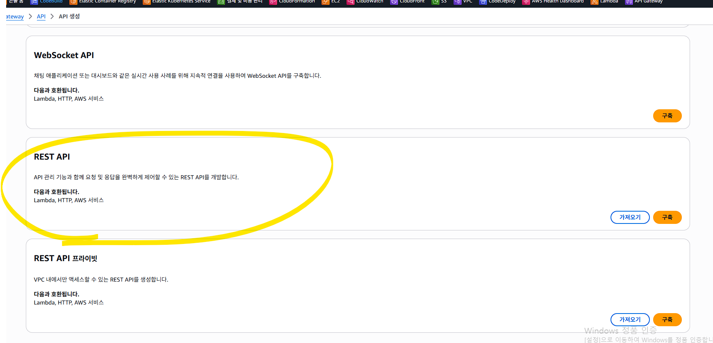
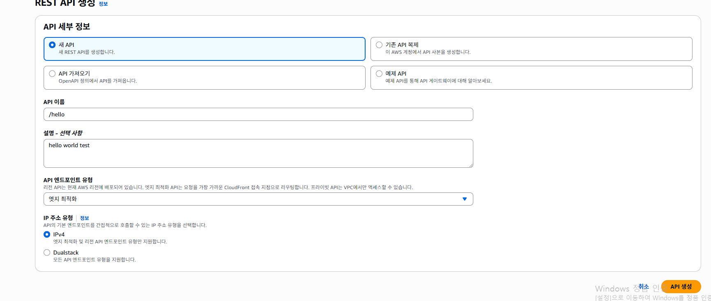


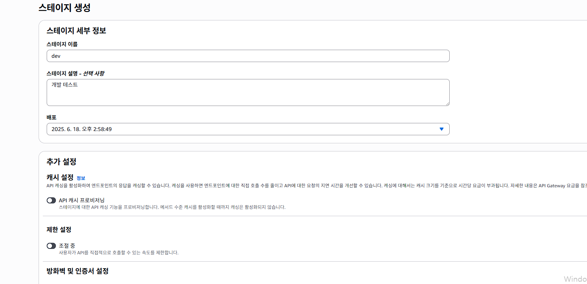
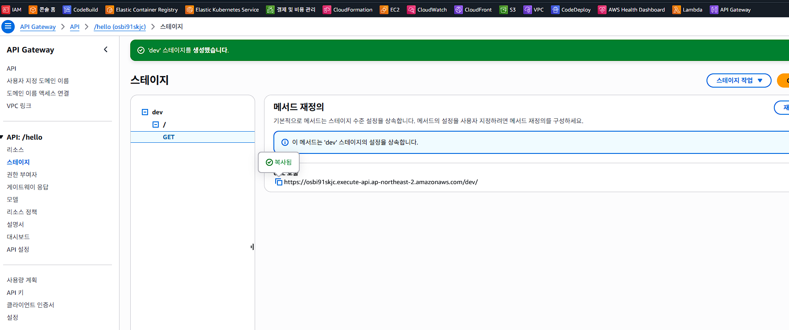

### 방법 B — AWS CLI

```bash
# 1. REST API 생성
API_ID=$(aws apigateway create-rest-api \
  --name "hello-api" \
  --query 'id' --output text)

# 2. 루트 리소스 ID 조회
ROOT_ID=$(aws apigateway get-resources \
  --rest-api-id $API_ID \
  --query 'items[?path==`/`].id' --output text)

# 3. /hello 리소스 생성
RESOURCE_ID=$(aws apigateway create-resource \
  --rest-api-id $API_ID \
  --parent-id $ROOT_ID \
  --path-part hello \
  --query 'id' --output text)

# 4. GET 메서드 생성
aws apigateway put-method \
  --rest-api-id $API_ID \
  --resource-id $RESOURCE_ID \
  --http-method GET \
  --authorization-type NONE

# 5. Lambda 프록시 통합 설정
LAMBDA_ARN="arn:aws:lambda:ap-northeast-2:086015456585:function:hello-api-dev-hello"
aws apigateway put-integration \
  --rest-api-id $API_ID \
  --resource-id $RESOURCE_ID \
  --http-method GET \
  --type AWS_PROXY \
  --integration-http-method POST \
  --uri "arn:aws:apigateway:ap-northeast-2:lambda:path/2015-03-31/functions/${LAMBDA_ARN}/invocations"

# 6. API Gateway의 Lambda 호출 권한 부여
aws lambda add-permission \
  --function-name hello-api-dev-hello \
  --statement-id apigateway-invoke \
  --action lambda:InvokeFunction \
  --principal apigateway.amazonaws.com \
  --source-arn "arn:aws:execute-api:ap-northeast-2:086015456585:${API_ID}/*/*"

# 7. 스테이지 배포
aws apigateway create-deployment \
  --rest-api-id $API_ID \
  --stage-name dev

echo "엔드포인트: https://c8wy9s5c3m.execute-api.ap-northeast-2.amazonaws.com/dev/hello"
```

### 방법 C — Serverless Framework (자동)

각 언어 디렉터리의 `serverless.yaml`에 `http` 이벤트가 정의되어 있으면
`serverless deploy` 한 번으로 Lambda + API Gateway + IAM 권한이 모두 자동으로 구성됩니다.
내부적으로 CloudFormation 스택을 생성합니다.

---

## GitHub Actions CI/CD 자동 배포

`main` 브랜치에 push 할 때마다 **변경된 언어 디렉터리만 감지**하여 해당 Lambda 함수를 자동으로 업데이트합니다.
워크플로 파일: [`.github/workflows/deploy-lambda.yml`](.github/workflows/deploy-lambda.yml)

### 워크플로 전체 흐름

```
push to main
    │
    ▼
① detect-changes 잡
   - git diff HEAD~1 HEAD 로 변경 파일 목록 추출
   - nodejs/, python/, java/ 각 경로 포함 여부 판별
   - 결과를 job output으로 전달 (nodejs=true/false 등)
    │
    ├─ nodejs=true ──▶ ② deploy-nodejs 잡 (병렬)
    │                   - actions/checkout@v4
    │                   - aws-actions/configure-aws-credentials@v4
    │                   - zip function.zip index.js handler.js
    │                   - aws lambda update-function-code
    │                   - aws lambda wait function-updated
    │                   - (선택) lambda-s3/index.js도 동일하게 배포
    │
    ├─ python=true ──▶ ③ deploy-python 잡 (병렬)
    │                   - zip function.zip handler.py
    │                   - aws lambda update-function-code
    │                   - aws lambda wait function-updated
    │
    └─ java=true   ──▶ ④ deploy-java 잡 (병렬)
                        - actions/setup-java@v4 (Temurin 17, Maven 캐시)
                        - mvn package -q  (Fat JAR 빌드)
                        - aws lambda update-function-code
                        - aws lambda wait function-updated
```

### 워크플로 상세 설명

#### ① 변경 감지 잡 (`detect-changes`)

```yaml
- name: Detect changed directories
  id: filter
  run: |
    BASE=$(git rev-parse HEAD~1 2>/dev/null || git hash-object -t tree /dev/null)
    CHANGED=$(git diff --name-only "$BASE" HEAD)

    grep -q "^nodejs/" <<< "$CHANGED" && echo "nodejs=true" >> "$GITHUB_OUTPUT" \
                                      || echo "nodejs=false" >> "$GITHUB_OUTPUT"
    grep -q "^python/" <<< "$CHANGED" && echo "python=true" >> "$GITHUB_OUTPUT" \
                                      || echo "python=false" >> "$GITHUB_OUTPUT"
    grep -q "^java/"   <<< "$CHANGED" && echo "java=true"   >> "$GITHUB_OUTPUT" \
                                      || echo "java=false"   >> "$GITHUB_OUTPUT"
```

- `git hash-object -t tree /dev/null`: 최초 커밋처럼 `HEAD~1`이 없을 때의 폴백 (빈 트리 해시)
- `$GITHUB_OUTPUT`: 잡 간 값을 전달하는 GitHub Actions 공식 메커니즘

#### ② 조건부 실행

```yaml
deploy-nodejs:
  needs: detect-changes
  if: needs.detect-changes.outputs.nodejs == 'true'
```

`nodejs/` 아래 파일이 하나도 바뀌지 않으면 이 잡은 **스킵**됩니다.
세 개의 배포 잡은 서로 `needs` 관계 없이 **병렬**로 실행됩니다.

#### ③ AWS 자격 증명 주입

```yaml
- uses: aws-actions/configure-aws-credentials@v4
  with:
    aws-access-key-id: ${{ secrets.AWS_ACCESS_KEY_ID }}
    aws-secret-access-key: ${{ secrets.AWS_SECRET_ACCESS_KEY }}
    aws-region: ${{ env.AWS_REGION }}
```

GitHub Secrets에 저장된 IAM 자격 증명을 실행기(ubuntu-latest)의 환경 변수로 주입합니다.
이후 `aws` CLI 명령이 자동으로 이 자격 증명을 사용합니다.

#### ④ 배포 및 완료 대기

```bash
aws lambda update-function-code \
  --function-name ${{ vars.LAMBDA_NODEJS_FUNCTION_NAME }} \
  --zip-file fileb://function.zip \
  --region ${{ env.AWS_REGION }}

aws lambda wait function-updated \
  --function-name ${{ vars.LAMBDA_NODEJS_FUNCTION_NAME }} \
  --region ${{ env.AWS_REGION }}
```

`update-function-code`는 비동기로 처리됩니다.
`wait function-updated`는 Lambda가 `Active` 상태가 될 때까지 폴링하여 배포 성공을 확인합니다.

### GitHub 설정 방법

**Settings → Secrets and variables → Actions**

#### Secrets (민감 정보 — 암호화 저장)

| 이름                      | 값                   |
| ------------------------- | -------------------- |
| `AWS_ACCESS_KEY_ID`     | IAM 사용자 액세스 키 |
| `AWS_SECRET_ACCESS_KEY` | IAM 사용자 시크릿 키 |

#### Variables (공개 설정값 — 평문 저장)

| 이름                               | 예시 값                    | 설명                     |
| ---------------------------------- | -------------------------- | ------------------------ |
| `LAMBDA_NODEJS_FUNCTION_NAME`    | `edumgt-lambda-nodejs`   | Node.js Lambda 함수 이름 |
| `LAMBDA_PYTHON_FUNCTION_NAME`    | `edumgt-lambda-python`   | Python Lambda 함수 이름  |
| `LAMBDA_JAVA_FUNCTION_NAME`      | `edumgt-lambda-java`     | Java Lambda 함수 이름    |
| `LAMBDA_S3_NODEJS_FUNCTION_NAME` | `edumgt-lambda-function` | S3 트리거 Lambda (선택)  |

> **주의:** `update-function-code`는 **이미 존재하는 함수**만 업데이트합니다.
> 함수를 처음 만들 때는 콘솔 또는 AWS CLI로 `create-function`을 먼저 실행해야 합니다.

### GitHub Actions용 IAM 최소 권한 정책

GitHub Actions 전용 IAM 사용자를 만들고 아래 권한만 부여하는 것을 권장합니다:

```json
{
  "Version": "2012-10-17",
  "Statement": [
    {
      "Sid": "LambdaDeployOnly",
      "Effect": "Allow",
      "Action": [
        "lambda:UpdateFunctionCode",
        "lambda:GetFunction",
        "lambda:GetFunctionConfiguration"
      ],
      "Resource": "arn:aws:lambda:ap-northeast-2:<ACCOUNT_ID>:function:edumgt-lambda-*"
    }
  ]
}
```

`lambda:GetFunctionConfiguration`은 `wait function-updated` 내부 폴링에 필요합니다.

### 워크플로 실행 확인

GitHub 레포지터리 → **Actions** 탭에서 실행 결과를 확인할 수 있습니다:

```
✅ detect-changes      — 변경 파일 감지 완료
✅ deploy-nodejs       — Node.js Lambda 배포 완료: edumgt-lambda-nodejs
⏭ deploy-python       — 변경 없음, 스킵
⏭ deploy-java         — 변경 없음, 스킵
```

---

## 권한 오류 해결 가이드

### CloudFormation 권한 오류

```
User ... is not authorized to perform: cloudformation:CreateChangeSet
```

**해결:** IAM → 사용자 → 권한 → `AWSCloudFormationFullAccess` 정책 추가


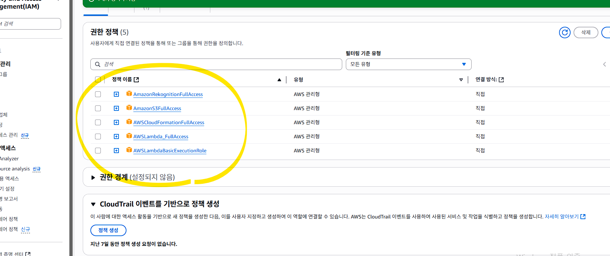

### API Gateway 권한 오류

```
... not authorized to perform: apigateway:PUT ...
```

**해결:** `AmazonAPIGatewayAdministrator` 정책 추가


### CloudFormation 스택 롤백 오류

```
Stack ... is in UPDATE_ROLLBACK_COMPLETE_CLEANUP_IN_PROGRESS state
```

**해결:** 스택 삭제 후 재시도

```bash
aws cloudformation delete-stack --stack-name hello-api-dev
```


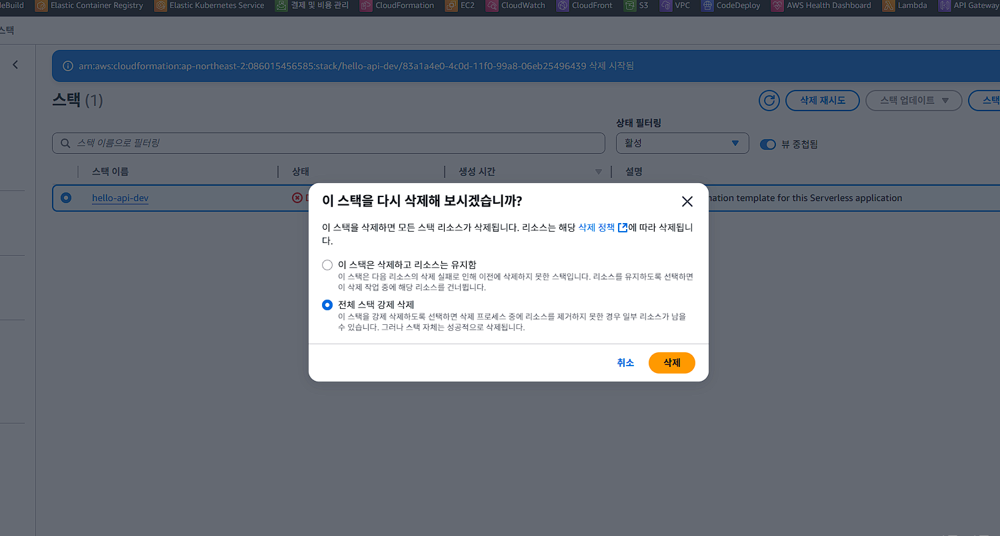

### CloudWatch Logs 권한 오류

```
logs:TagResource permission is required
```

**해결:** `logs:TagResource` 권한이 포함된 커스텀 정책 추가


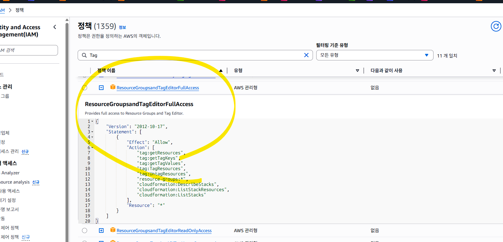


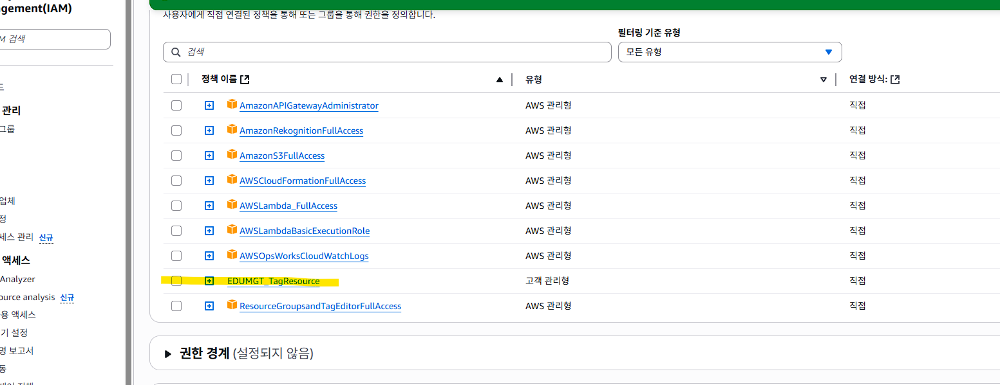
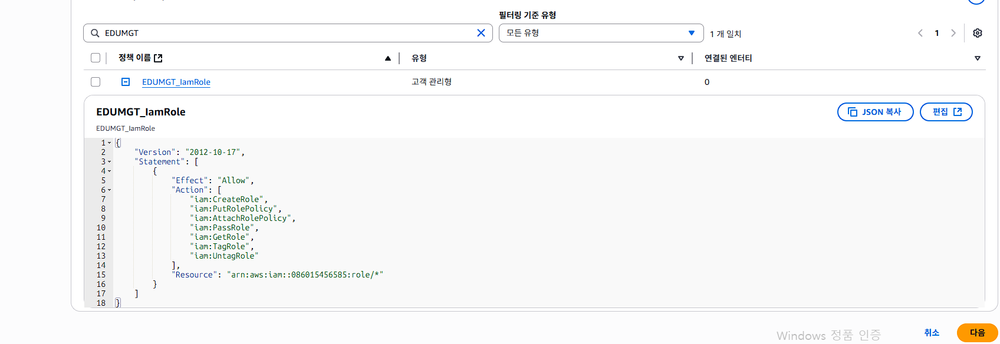


### Log Group 중복 오류

```
Resource of type 'AWS::Logs::LogGroup' ... already exists.
```

**해결:** 기존 Log Group 삭제 후 재실행

```bash
aws logs delete-log-group --log-group-name /aws/lambda/<FUNCTION_NAME>
```


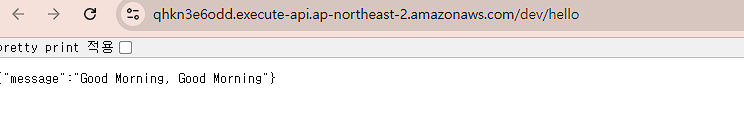

---

## AWS CLI 명령어 모음

```bash
# ── Lambda ────────────────────────────────────────────────────────────
# 함수 목록 조회
aws lambda list-functions --region ap-northeast-2

# 함수 정보 조회
aws lambda get-function --function-name <FUNCTION_NAME>

# 함수 설정 조회 (런타임, 메모리, 핸들러 등)
aws lambda get-function-configuration --function-name <FUNCTION_NAME>

# 함수 호출
aws lambda invoke \
  --function-name <FUNCTION_NAME> \
  --payload '{"queryStringParameters":{"name":"Test"}}' \
  --cli-binary-format raw-in-base64-out \
  output.json && cat output.json

# 함수 코드 업데이트
aws lambda update-function-code \
  --function-name <FUNCTION_NAME> \
  --zip-file fileb://function.zip \
  --region ap-northeast-2

# 함수 업데이트 완료 대기
aws lambda wait function-updated --function-name <FUNCTION_NAME>

# 함수 삭제
aws lambda delete-function --function-name <FUNCTION_NAME>

# ── API Gateway ────────────────────────────────────────────────────────
# REST API 목록 조회
aws apigateway get-rest-apis

# ── CloudFormation ─────────────────────────────────────────────────────
# 스택 목록 조회
aws cloudformation list-stacks --stack-status-filter CREATE_COMPLETE UPDATE_COMPLETE

# 스택 삭제
aws cloudformation delete-stack --stack-name <STACK_NAME>

# ── S3 ─────────────────────────────────────────────────────────────────
# 버킷 생성 (서울 리전)
aws s3api create-bucket \
  --bucket <BUCKET_NAME> \
  --region ap-northeast-2 \
  --create-bucket-configuration LocationConstraint=ap-northeast-2

# 파일 업로드
aws s3 cp face1.png s3://<BUCKET_NAME>/

# 버킷/객체 목록
aws s3 ls
aws s3 ls s3://<BUCKET_NAME>/

# ── CloudWatch Logs ────────────────────────────────────────────────────
# 로그 그룹 목록
aws logs describe-log-groups

# 로그 스트림 목록
aws logs describe-log-streams --log-group-name /aws/lambda/<FUNCTION_NAME>

# 로그 이벤트 조회
aws logs get-log-events \
  --log-group-name /aws/lambda/<FUNCTION_NAME> \
  --log-stream-name <LOG_STREAM_NAME>

# 로그 그룹 삭제
aws logs delete-log-group --log-group-name /aws/lambda/<FUNCTION_NAME>

# ── IAM ────────────────────────────────────────────────────────────────
# 역할의 연결 정책 목록
aws iam list-attached-role-policies --role-name <ROLE_NAME>

# Lambda에 권한 추가 (S3 → Lambda 호출 허용)
aws lambda add-permission \
  --function-name <FUNCTION_NAME> \
  --principal s3.amazonaws.com \
  --statement-id AllowS3Invoke \
  --action lambda:InvokeFunction \
  --source-arn arn:aws:s3:::<BUCKET_NAME>
```


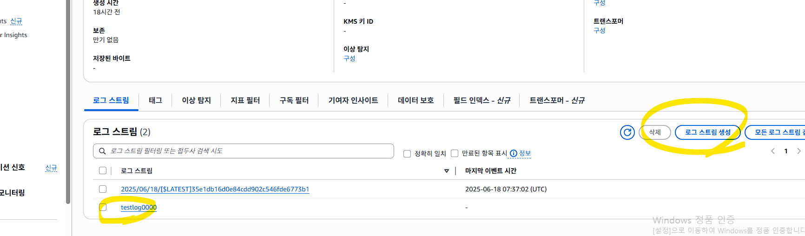

---

## 추가 실습

- [Lambda + S3 이벤트 트리거 실습 가이드](docs/lambda-s3/README.md)S3에 파일 업로드 시 Lambda 자동 실행 → CloudWatch Logs 확인까지 전 과정 실습
- AWS Well-Architected 참고: https://aws.amazon.com/ko/architecture


---

### RDS 연동

```bash
mysql -h database-edumgt.cg0ugoglztrn.ap-northeast-2.rds.amazonaws.com -P 3306 -u root -p --ssl-mode=VERIFY_IDENTITY --ssl-ca=./global-bundle.pem
```

---

```bash
curl -X POST https://qri7el2x7z4ym4zowsk3go5uey0bjmti.lambda-url.ap-northeast-2.on.aws/users \
  -H "Content-Type: application/json" \
  -d '{
    "name": "홍길동",
    "password": "mypassword",
    "phone": "010-1234-5678",
    "email": "hong@example.com"
  }'
```

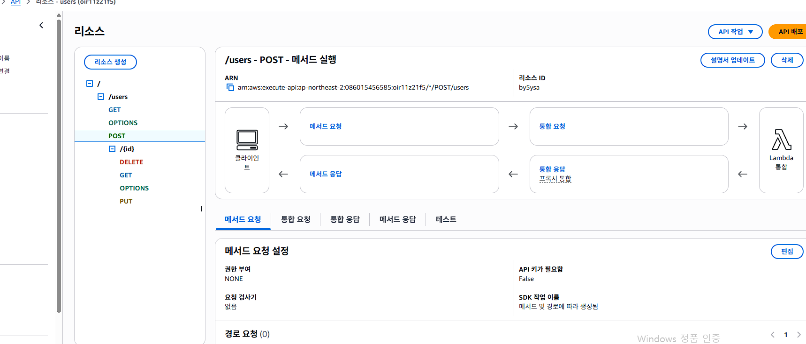

---


# AWS AI 서비스별 ML/DL 알고리즘 및 내부 아키텍처 가이드

AWS의 AI/ML 서비스는 크게 **전통적 머신러닝(ML) 알고리즘**을 사용하는 서비스와, **심층 신경망 기반의 딥러닝(DL) 및 생성형 AI(GenAI)** 기술을 사용하는 서비스로 분류됩니다. 본 문서는 주요 서비스의 핵심 기술과 내부 데이터 흐름을 상세히 다룹니다.

---

## 1. AWS AI 리소스별 핵심 기술 및 알고리즘 분류

### 1) 딥러닝(DL) 및 생성형 AI 기반 서비스

대규모 비정형 데이터(텍스트, 이미지, 음성, 영상)를 처리하는 서비스들은 심층 신경망(Deep Neural Networks) 구조를 기반으로 작동합니다.

* **Amazon Bedrock / Amazon Q**
  * **핵심 기술:** 트랜스포머(Transformer) 기반 거대언어모델(LLM - 예: Amazon Nova, Claude, Llama) 및 확산 모델(Diffusion Model - 이미지 생성)
* **Amazon Rekognition**
  * **핵심 기술:** 합성곱 신경망(CNN), 비전 트랜스포머(ViT), 객체 탐지(YOLO, SSD 계열), 고속 근사 최근접 이웃(ANN) 검색 알고리즘
* **Amazon Comprehend**
  * **핵심 기술:** BERT, RoBERTa 계열의 양방향 트랜스포머 인코더, 조건부 확률장(CRF), 잠재 디리클레 할당(LDA - 토픽 모델링용)
* **Amazon Transcribe**
  * **핵심 기술:** Conformer/Transformer 백본, 연결주의 시간 분류(CTC) 디코더, 주파수 변환(Log-Mel Spectrogram), 화자 분리(Diarization) 클러스터링
* **Amazon Polly**
  * **핵심 기술:** WaveNet 스타일의 생성형 신경망, Tacotron 계열의 음성 합성 신경망(TTS)
* **Amazon Lex**
  * **핵심 기술:** 트랜스포머 기반 자연어 이해(NLU), 시퀀스-투-시퀀스(Seq2Seq) 대화 관리 기술
* **Amazon Textract**
  * **핵심 기술:** CNN + 트랜스포머 결합 구조 (LayoutLM 계열의 문서 구조 이해 기술)

### 2) 전통적 머신러닝(ML) 기반 서비스

정형 데이터(엑셀, DB), 시계열 예측, 통계성 분석에는 연산 효율성과 설명 가능성이 높은 통계/머신러닝 알고리즘이 사용됩니다.

* **Amazon Forecast**
  * **핵심 기술:** 통계 기반 알고리즘(ARIMA, ETS) + 딥러닝 기반 시계열 모델(DeepAR, CNN-QR) 하이브리드 구성
* **Amazon Fraud Detector**
  * **핵심 기술:** 그레이디언트 부스팅 트리(GBDT, 주로 XGBoost 계열) 및 로지스틱 회귀 알고리즘
* **Amazon Personalize**
  * **핵심 기술:** 협업 필터링(Collaborative Filtering), 행렬 분해(Matrix Factorization) 및 사용자 행동 분석을 위한 순환 신경망(HRNN)

### 3) ML/DL 통합 플랫폼

* **Amazon SageMaker AI**
  * **전통적 ML:** XGBoost, Linear Learner, K-Means, PCA, Random Forest 등 내장 제공
  * **딥러닝 프레임워크:** PyTorch, TensorFlow, Hugging Face 등을 활용한 커스텀 모델(CNN, RNN, LLM 등) 학습 및 배포 지원

---

## 2. 주요 서비스별 내부 기술 구조 및 데이터 흐름

### 📌 Amazon Bedrock (생성형 AI 오케스트레이션)

대규모 언어 모델(LLM)과 기초 모델(FM)을 안전하고 확장성 있게 서빙하기 위한 플랫폼입니다.

#### 💡 내부 기술 구조

* **분산 추론 게이트웨이:** API 요청을 수신하여 다중 가용영역(Multi-AZ)에 분산된 컴퓨트 레이어로 실시간 로드 밸런싱을 수행합니다.
* **전용 칩 기반 가속 클러스터:** AWS Inferentia2, Trainium 가속기 및 GPU를 활용하여 모델 가상화 기술 기반의 고속 추론을 제공합니다.
* **RAG (검색 증강 생성) 엔진:** 입력 프롬프트를 벡터로 임베딩하여 Amazon OpenSearch Serverless 등 벡터 데이터베이스와 실시간 매칭합니다.

#### 🔄 데이터 흐름

1. **요청 수신:** 사용자 앱이 프롬프트(텍스트/이미지)와 함께 API를 호출합니다.
2. **가드레일 검증:** Bedrock Guardrails가 유해 콘텐츠 및 개인정보(PII) 누출 여부를 먼저 필터링합니다.
3. **컨텍스트 보강 (RAG 활성화 시):** 지식 가방(Knowledge Bases)을 거쳐 관련 문서를 벡터 검색한 후 원래 프롬프트에 결합합니다.
4. **모델 추론:** 완성된 프롬프트가 대형 언어 모델(LLM)에 전달되어 차례대로 다음 토큰을 확률 연산합니다.
5. **스트리밍 반환:** 생성되는 토큰을 청크(Chunk) 단위로 사용자 화면에 실시간 응답합니다.

---

### 📌 Amazon Rekognition (컴퓨터 비전 분석)

이미지와 비디오 내부의 객체, 얼굴, 텍스트 등을 탐지하는 멀티태스킹 비전 파이프라인입니다.

#### 💡 내부 기술 구조

* **전처리 디코딩 레이어:** 입력된 미디어 파일의 압축을 메모리상에 풀고 고정 해상도로 리사이징 및 정규화를 수행합니다.
* **다중 작업 CNN/ViT:** 이미지 1장당 객체 탐지, 텍스트 인식, 얼굴 분석 등 전용 백본(Backbone) 신경망들이 비동기 병렬로 작동합니다.
* **특징 매칭 엔진 (K-NN):** 추출한 얼굴 특징 벡터를 기반으로 대규모 얼굴 컬렉션 DB 내에서 근사 최근접 이웃(ANN) 검색을 수행합니다.

#### 🔄 데이터 흐름

1. **미디어 입력:** Base64 이미지 바이트 데이터나 Amazon S3 객체 URI를 통해 API 요청이 들어옵니다.
2. **텐서 변환:** 이미지 디코딩 및 비디오 프레임 단위 샘플링 후 학습 가능한 텐서(Tensor) 배열로 변환합니다.
3. **병렬 모델 추론:** 다중 신경망 구조를 동시에 거치며 객체 좌표(Bounding Box) 추출 및 얼굴 임베딩 벡터 생성이 수행됩니다.
4. **매칭 및 포스트 프로세싱:** 사전에 수립된 신뢰도 임계값(Threshold)을 넘는 결과만 최종 선별합니다.
5. **결과 출력:** 객체 레이블 정보와 매칭 유사도 등을 담은 구조화된 JSON 형태로 클라이언트에 반환합니다.

---

### 📌 Amazon Transcribe (음성 인식 - STT)

오디오 파일 또는 스트림 데이터를 텍스트 시퀀스로 변환하는 오디오 전용 딥러닝 시스템입니다.

#### 💡 내부 기술 구조

* **어쿠스틱 피처 추출기:** 아날로그 오디오 신호를 20~30ms 단위로 분할하여 주파수 텐서 데이터(Log-Mel Spectrogram)로 가공합니다.
* **Conformer / Transformer 백본:** 소음 제어와 문맥 이해에 탁월한 CNN 및 Self-Attention 하이브리드 신경망을 활용해 음향 특징을 인식합니다.
* **CTC 디코더:** 음성 데이터와 텍스트 문장의 길이 불일치 문제를 해결하기 위해 타임스탬프 기반 정렬 알고리즘을 수행합니다.

#### 🔄 데이터 흐름

1. **음성 주입:** S3 배치 업로드 혹은 웹소켓(WebSocket) 스트림을 통해 오디오 신호가 수신됩니다.
2. **주파수 인코딩:** 음성 신호가 원시 데이터에서 시각화된 주파수 맵 형태로 디코딩됩니다.
3. **신경망 디코딩:** Conformer 신경망과 CTC 레이어를 거쳐 발음 기호 및 단어 시퀀스로 추론됩니다.
4. **텍스트 가공:** 화자 분리(Diarization) 클러스터링과 구두점 자동 삽입 알고리즘이 적용됩니다.
5. **결과 반환:** 텍스트 문장과 화자 정보, 타임스탬프가 매핑된 JSON 결과가 반환됩니다.

---

### 📌 Amazon Comprehend (자연어 처리 - NLP)

텍스트 문서 내 비즈니스 가치와 의미를 추출하는 양방향 자연어 이해(NLU) 엔진입니다.

#### 💡 내부 기술 구조

* **토크나이저:** 문장을 WordPiece 또는 BPE 알고리즘 기반으로 분리하여 모르는 단어(OOV) 문제를 방지합니다.
* **양방향 트랜스포머 (BERT 계열):** 주변 단어들과의 어텐션(Attention) 가중치를 분석하여 동음이의어의 의미를 정확하게 문맥적으로 인지합니다.
* **CRF 레이어 / LDA 모델:** 문장 속 명사들의 배치 순서 확률을 바탕으로 개체명을 인식하며, 대량 문서 분석 시 통계적 토픽 모델링을 실행합니다.

#### 🔄 데이터 흐름

1. **원문 입력:** 분석을 원하는 일반 텍스트 문서가 인풋으로 들어옵니다.
2. **토큰화 및 정규화:** 불필요한 기호 제거 및 어휘 분석을 위한 토큰화가 이루어집니다.
3. **문맥 임베딩:** 고차원 문맥 벡터로 변환된 데이터가 BERT 계열 분류 레이어로 전달됩니다.
4. **추론 및 태깅:** 감정 상태(긍정/부정), 핵심 구절, 개인정보(PII) 스코어가 계산됩니다.
5. **구조화:** 최종 식별된 개체 정보와 신뢰도 점수가 취합되어 JSON 데이터로 출력됩니다.

---

### 📌 Amazon Forecast (시계열 수요 예측)

비즈니스의 정형 데이터를 학습하여 미래의 특정 시점 가치를 다각도로 예측하는 하이브리드 프레임워크입니다.

#### 💡 내부 기술 구조

* **DeepAR (시계열 RNN):** 여러 연관 시계열 데이터의 상호 관계를 하나의 거대한 순환 신경망 구조로 동시에 학습하는 알고리즘입니다.
* **CNN-QR (Convolutional Quantile Regression):** 인과 관계 학습에 빠른 CNN 구조를 시계열에 접목하여 특정 단일 값이 아닌 '확률 구간별 분위수'를 산출합니다.
* **통계/ML 백엔드 (ARIMA, Prophet):** 단순한 주기성을 가졌거나 데이터 기간이 짧을 때는 경량 통계 분석 모델을 동적으로 앙상블합니다.

#### 🔄 데이터 흐름

1. **데이터 수집:** 핵심 시계열 데이터(매출 이력 등)와 메타데이터가 입력됩니다.
2. **피처 엔지니어링:** 누락된 값(결측치)을 대체하고 날짜/요일 정보 등의 특성을 자동 추출합니다.
3. **Auto Predictor 실행:** 데이터셋 규모에 알맞은 알고리즘(DeepAR / CNN-QR / ARIMA 등)이 앙상블 형태로 학습/추론됩니다.
4. **분위수 평가:** 예측의 불확실성을 감안하여 p10, p50, p90 등의 확률 기반 구간 값이 도출됩니다.
5. **예측치 내보내기:** 결과 데이터가 가시화되거나 S3 버킷으로 자동 내보내기(Export) 처리됩니다.

---

## 3. Python Lambda로 AWS AI 리소스 호출 예제

이 레포에는 위 개념 설명을 바로 실습할 수 있도록 [`python/ai_handler.py`](python/ai_handler.py) 예제가 추가되어 있습니다. API Gateway가 HTTP 요청을 받으면 Lambda가 본문을 해석한 뒤 AWS AI 서비스에 위임하고, 결과를 다시 JSON으로 반환하는 구조입니다.

```text
Client
  -> API Gateway
  -> Lambda (python/ai_handler.py)
  -> Amazon Comprehend or Amazon Rekognition
  -> JSON Response
```

### 예제 1. Amazon Comprehend 텍스트 분석

사용 시나리오:

- 고객 리뷰 감정 분석
- 문의 문장에서 상품명, 지역명, 브랜드명 추출
- 영어 또는 스페인어 본문에 대한 PII 포함 여부 사전 점검

요청 예시:

```json
{
  "text": "John Smith from Seattle said the delivery was quick, but he wants updates sent to john@example.com.",
  "language_code": "en",
  "detect_pii": true
}
```

응답 예시:

```json
{
  "service": "amazon-comprehend",
  "language_code": "en",
  "sentiment": "MIXED",
  "entity_count": 2,
  "entities": [
    { "text": "John Smith", "type": "PERSON", "score": 0.9981 },
    { "text": "Seattle", "type": "LOCATION", "score": 0.9724 }
  ],
  "pii_entities": [
    { "type": "NAME", "score": 0.9999, "begin_offset": 0, "end_offset": 10 },
    { "type": "EMAIL", "score": 0.9997, "begin_offset": 70, "end_offset": 86 }
  ]
}
```

### 예제 2. Amazon Rekognition 이미지 레이블 분석

사용 시나리오:

- 업로드 이미지 자동 태깅
- 상품 사진 분류 전처리
- 운영자 검수용 메타데이터 생성

요청 예시:

```json
{
  "s3_bucket": "replace-with-your-bucket",
  "s3_key": "images/sample.png",
  "max_labels": 8,
  "min_confidence": 75
}
```

응답 예시:

```json
{
  "service": "amazon-rekognition",
  "label_count": 3,
  "labels": [
    { "name": "Laptop", "confidence": 98.41, "categories": ["Electronics"] },
    { "name": "Screen", "confidence": 95.8, "categories": ["Electronics"] },
    { "name": "Office", "confidence": 82.13, "categories": ["Indoors"] }
  ]
}
```

### 배포 포인트

- `python/serverless.yaml`에 `comprehend:DetectSentiment`, `comprehend:DetectEntities`, `comprehend:DetectPiiEntities`, `rekognition:DetectLabels` 권한이 포함되어 있습니다.
- Boto3는 Lambda Python 런타임에 기본 포함되어 있어 별도 패키징 없이 예제를 실행할 수 있습니다.
- `DetectPiiEntities`는 언어 제약이 있어, 예제 코드에서는 `en` 또는 `es`가 아니면 경고를 반환하고 본문 감정/개체 분석만 계속 수행합니다.
- 샘플 이벤트는 [`python/events/ai-text-event.json`](python/events/ai-text-event.json), [`python/events/ai-image-event.json`](python/events/ai-image-event.json)에 넣어 두었습니다.
