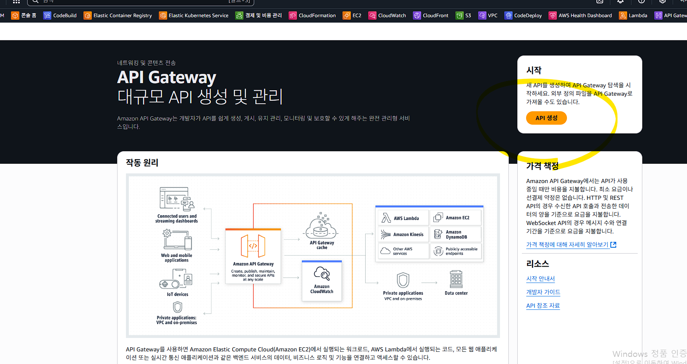
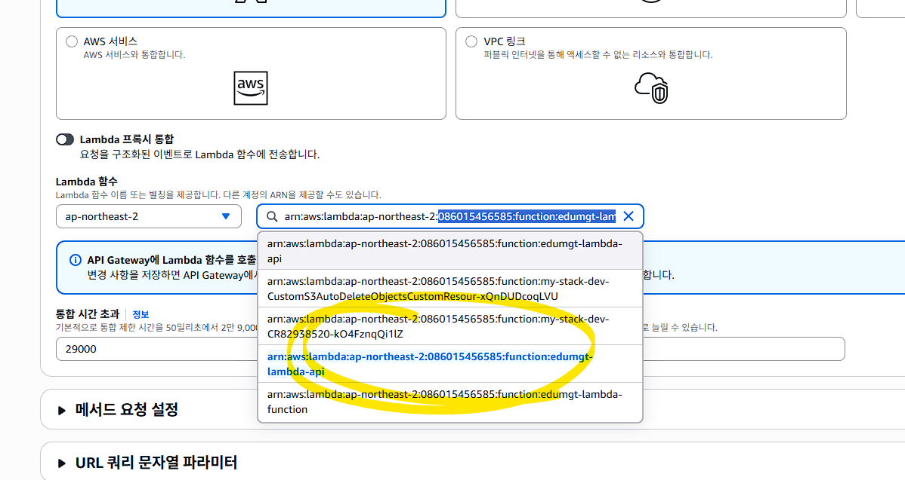
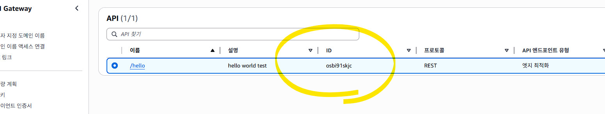
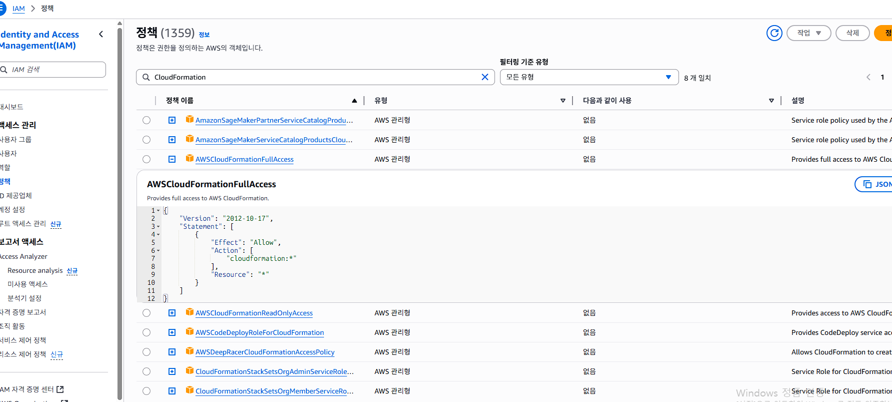
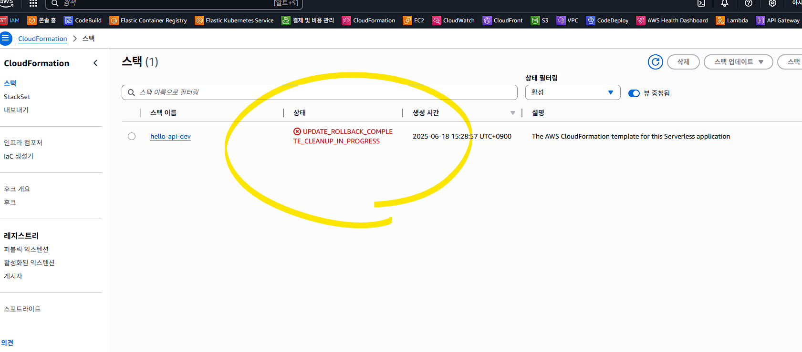
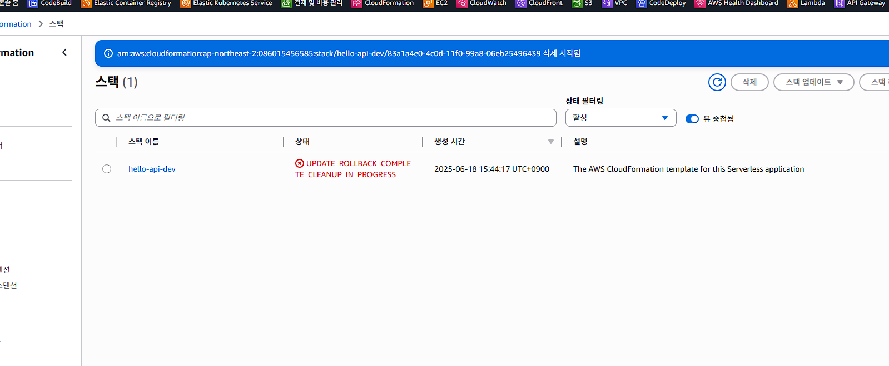

# 🚀 AWS Serverless Deployment — Node.js · Python · Java + API Gateway + AWS CLI

> **A hands-on, screenshot-driven tutorial for deploying serverless functions on AWS Lambda with API Gateway, covering Node.js, Python, and Java — via both the AWS Console and the AWS CLI.**

[](LICENSE)
[](nodejs/)
[](python/)
[](java/)
[](https://www.serverless.com/)
[](https://aws.amazon.com/)

---

## 📖 Table of Contents

1. [Overview](#overview)
2. [Architecture](#architecture)
3. [Prerequisites](#prerequisites)
4. [AWS CLI — Setup & Configuration](#aws-cli--setup--configuration)
5. [Node.js Serverless Deployment](#nodejs-serverless-deployment)
   - [Console walkthrough](#nodejs-console-walkthrough)
   - [CLI deployment](#nodejs-cli-deployment)
   - [Serverless Framework deployment](#nodejs-serverless-framework-deployment)
6. [Python Serverless Deployment](#python-serverless-deployment)
   - [Console walkthrough](#python-console-walkthrough)
   - [CLI deployment](#python-cli-deployment)
   - [Serverless Framework deployment](#python-serverless-framework-deployment)
7. [Java Serverless Deployment](#java-serverless-deployment)
   - [Console walkthrough](#java-console-walkthrough)
   - [CLI deployment](#java-cli-deployment)
   - [Serverless Framework deployment](#java-serverless-framework-deployment)
8. [API Gateway Integration](#api-gateway-integration)
9. [Troubleshooting & IAM Permissions](#troubleshooting--iam-permissions)
10. [AWS CLI Cheat Sheet](#aws-cli-cheat-sheet)
11. [Sponsorship](#sponsorship)

---

## Overview

This repository is an **educational lab** for deploying serverless applications on **AWS Lambda** with **Amazon API Gateway**.  
Each language directory contains a ready-to-deploy example you can use as a starting point.

| Directory | Runtime | Deployment config |
|---|---|---|
| `nodejs/` (root) | Node.js 20.x | `serverless.yaml` |
| `python/` | Python 3.12 | `python/serverless.yaml` |
| `java/` | Java 17 | `java/serverless.yaml` |

---

## Architecture

```
Client (Browser / curl / Postman)
        │  HTTP GET /hello?name=...
        ▼
 ┌─────────────────────┐
 │   Amazon API Gateway│  ← REST API or HTTP API
 └──────────┬──────────┘
            │  Lambda Proxy Integration
            ▼
 ┌─────────────────────┐
 │   AWS Lambda        │  ← Node.js / Python / Java handler
 └──────────┬──────────┘
            │  Logs / Metrics
            ▼
 ┌─────────────────────┐
 │  Amazon CloudWatch  │
 └─────────────────────┘
```

---

## Prerequisites

| Tool | Version | Install |
|---|---|---|
| AWS Account | — | [Sign up](https://aws.amazon.com/free/) |
| AWS CLI | v2 | [Install guide](#aws-cli--setup--configuration) |
| Node.js | 18+ | [nodejs.org](https://nodejs.org/) |
| Python | 3.12 | [python.org](https://www.python.org/) |
| Java (JDK) | 17 | [adoptium.net](https://adoptium.net/) |
| Maven | 3.8+ | [maven.apache.org](https://maven.apache.org/) |
| Serverless Framework | 3.x | `npm install -g serverless@3` |

---

## AWS CLI — Setup & Configuration

### 1. Install AWS CLI v2

**macOS / Linux**
```bash
curl "https://awscli.amazonaws.com/awscli-exe-linux-x86_64.zip" -o "awscliv2.zip"
unzip awscliv2.zip
sudo ./aws/install
aws --version
```

**Windows (PowerShell)**
```powershell
msiexec.exe /i https://awscli.amazonaws.com/AWSCLIV2.msi
aws --version
```

### 2. Configure Credentials

```bash
aws configure
# AWS Access Key ID     [None]: <YOUR_ACCESS_KEY>
# AWS Secret Access Key [None]: <YOUR_SECRET_KEY>
# Default region name   [None]: ap-northeast-2
# Default output format [None]: json
```

> 💡 **Best Practice:** Use IAM roles or AWS SSO instead of long-lived access keys for production workflows.

### 3. Verify

```bash
aws sts get-caller-identity
```

---

## Node.js Serverless Deployment

### Function Code

```javascript
// handler.js
module.exports.hello = async (event) => {
  const name = event.queryStringParameters?.name || "World";
  return {
    statusCode: 200,
    body: JSON.stringify({ message: `Hello, ${name}!`, language: "Node.js" }),
  };
};
```

### Node.js Console Walkthrough

1. Go to **AWS Console → Lambda → Create function**.
2. Choose **Author from scratch**.
3. Set **Runtime** to `Node.js 20.x`.
4. Paste the handler code above into the inline editor.
5. Save and **Test** the function.


### Node.js CLI Deployment

**Step 1 — Zip the code**
```bash
# Linux / macOS
zip function.zip index.js

# Windows PowerShell
Compress-Archive -Path index.js -DestinationPath function.zip
```

**Step 2 — Create the Lambda function**
```bash
aws lambda create-function \
  --function-name edumgt-lambda-nodejs \
  --runtime nodejs20.x \
  --role arn:aws:iam::<ACCOUNT_ID>:role/<ROLE_NAME> \
  --handler index.handler \
  --zip-file fileb://function.zip \
  --region ap-northeast-2
```

**Step 3 — Update the function (after code changes)**
```bash
aws lambda update-function-code \
  --function-name edumgt-lambda-nodejs \
  --zip-file fileb://function.zip \
  --region ap-northeast-2
```

**Step 4 — Invoke the function**
```bash
aws lambda invoke \
  --function-name edumgt-lambda-nodejs \
  --payload '{"queryStringParameters":{"name":"Alice"}}' \
  --cli-binary-format raw-in-base64-out \
  response.json
cat response.json
```

### Node.js Serverless Framework Deployment

```bash
# Install Serverless Framework (v3 — no login required)
npm install -g serverless@3

# Deploy (uses serverless.yaml at repo root)
serverless deploy

# Remove the stack
serverless remove
```

`serverless.yaml` (root):
```yaml
service: hello-api

provider:
  name: aws
  runtime: nodejs18.x
  region: ap-northeast-2

functions:
  hello:
    handler: handler.hello
    events:
      - http:
          path: hello
          method: get
```

---

## Python Serverless Deployment

### Function Code

```python
# python/handler.py
import json

def hello(event, context):
    query_params = event.get("queryStringParameters") or {}
    name = query_params.get("name", "World")
    body = {"message": f"Hello, {name}!", "language": "Python"}
    return {
        "statusCode": 200,
        "headers": {"Content-Type": "application/json"},
        "body": json.dumps(body),
    }
```

### Python Console Walkthrough

1. Go to **AWS Console → Lambda → Create function**.
2. Choose **Author from scratch**.
3. Set **Runtime** to `Python 3.12`.
4. In the **Code** tab, paste the handler code above.
5. Set **Handler** to `handler.hello`.
6. Save and **Test** the function with a test event:
   ```json
   { "queryStringParameters": { "name": "Alice" } }
   ```

### Python CLI Deployment

**Step 1 — Zip the handler**
```bash
cd python
zip function.zip handler.py
```

**Step 2 — Create the Lambda function**
```bash
aws lambda create-function \
  --function-name edumgt-lambda-python \
  --runtime python3.12 \
  --role arn:aws:iam::<ACCOUNT_ID>:role/<ROLE_NAME> \
  --handler handler.hello \
  --zip-file fileb://function.zip \
  --region ap-northeast-2
```

**Step 3 — Invoke the function**
```bash
aws lambda invoke \
  --function-name edumgt-lambda-python \
  --payload '{"queryStringParameters":{"name":"Alice"}}' \
  --cli-binary-format raw-in-base64-out \
  response.json
cat response.json
```

**Step 4 — Update the function code**
```bash
aws lambda update-function-code \
  --function-name edumgt-lambda-python \
  --zip-file fileb://function.zip \
  --region ap-northeast-2
```

### Python Serverless Framework Deployment

```bash
cd python
serverless deploy
```

`python/serverless.yaml`:
```yaml
service: hello-api-python

provider:
  name: aws
  runtime: python3.12
  region: ap-northeast-2

functions:
  hello:
    handler: handler.hello
    events:
      - http:
          path: hello
          method: get
          cors: true
```

---

## Java Serverless Deployment

### Function Code

```java
// java/src/main/java/com/example/HelloHandler.java
package com.example;

import com.amazonaws.services.lambda.runtime.Context;
import com.amazonaws.services.lambda.runtime.RequestHandler;
import com.amazonaws.services.lambda.runtime.events.APIGatewayProxyRequestEvent;
import com.amazonaws.services.lambda.runtime.events.APIGatewayProxyResponseEvent;
import java.util.Map;
import java.util.HashMap;

public class HelloHandler
        implements RequestHandler<APIGatewayProxyRequestEvent, APIGatewayProxyResponseEvent> {

    @Override
    public APIGatewayProxyResponseEvent handleRequest(
            APIGatewayProxyRequestEvent input, Context context) {
        Map<String, String> params = input.getQueryStringParameters();
        String name = (params != null && params.containsKey("name")) ? params.get("name") : "World";

        Map<String, String> headers = new HashMap<>();
        headers.put("Content-Type", "application/json");

        String body = String.format("{\"message\": \"Hello, %s!\", \"language\": \"Java\"}", name);
        return new APIGatewayProxyResponseEvent()
                .withStatusCode(200).withHeaders(headers).withBody(body);
    }
}
```

### Java Console Walkthrough

1. Build the fat JAR with Maven:
   ```bash
   cd java
   mvn package
   # Produces: target/hello-lambda-1.0-SNAPSHOT.jar
   ```
2. Go to **AWS Console → Lambda → Create function**.
3. Choose **Author from scratch**.
4. Set **Runtime** to `Java 17`.
5. Upload the JAR file under **Code → Upload from → .jar file**.
6. Set **Handler** to `com.example.HelloHandler`.
7. Set **Memory** to at least `512 MB` (Java cold start).
8. Save and **Test** the function.

### Java CLI Deployment

**Step 1 — Build the JAR**
```bash
cd java
mvn package
```

**Step 2 — Create the Lambda function**
```bash
aws lambda create-function \
  --function-name edumgt-lambda-java \
  --runtime java17 \
  --role arn:aws:iam::<ACCOUNT_ID>:role/<ROLE_NAME> \
  --handler com.example.HelloHandler \
  --zip-file fileb://target/hello-lambda-1.0-SNAPSHOT.jar \
  --memory-size 512 \
  --timeout 15 \
  --region ap-northeast-2
```

**Step 3 — Invoke the function**
```bash
aws lambda invoke \
  --function-name edumgt-lambda-java \
  --payload '{"queryStringParameters":{"name":"Alice"}}' \
  --cli-binary-format raw-in-base64-out \
  response.json
cat response.json
```

### Java Serverless Framework Deployment

```bash
cd java
mvn package          # build the fat JAR first
serverless deploy
```

`java/serverless.yaml`:
```yaml
service: hello-api-java

provider:
  name: aws
  runtime: java17
  region: ap-northeast-2

package:
  artifact: target/hello-lambda-1.0-SNAPSHOT.jar

functions:
  hello:
    handler: com.example.HelloHandler
    memorySize: 512
    timeout: 15
    events:
      - http:
          path: hello
          method: get
          cors: true
```

---

## API Gateway Integration

### Option A — AWS Console

1. Open **AWS Console → API Gateway**.
2. Choose **REST API → Build**.
3. Create a new **Resource** `/hello`.
4. Add a **GET Method** → Integration type: **Lambda Function**.
5. Select your Lambda function, enable **Lambda Proxy integration**.
6. Click **Deploy API** → create a new **Stage** (e.g. `dev`).
7. Note the **Invoke URL**:
   ```
   https://<API_ID>.execute-api.ap-northeast-2.amazonaws.com/dev/hello?name=Alice
   ```

  
  
  


### Option B — AWS CLI

```bash
# 1. Create REST API
API_ID=$(aws apigateway create-rest-api \
  --name "hello-api" \
  --query 'id' --output text)

# 2. Get root resource ID
ROOT_ID=$(aws apigateway get-resources \
  --rest-api-id $API_ID \
  --query 'items[?path==`/`].id' --output text)

# 3. Create /hello resource
RESOURCE_ID=$(aws apigateway create-resource \
  --rest-api-id $API_ID \
  --parent-id $ROOT_ID \
  --path-part hello \
  --query 'id' --output text)

# 4. Create GET method
aws apigateway put-method \
  --rest-api-id $API_ID \
  --resource-id $RESOURCE_ID \
  --http-method GET \
  --authorization-type NONE

# 5. Set Lambda integration
LAMBDA_ARN="arn:aws:lambda:ap-northeast-2:<ACCOUNT_ID>:function:edumgt-lambda-nodejs"
aws apigateway put-integration \
  --rest-api-id $API_ID \
  --resource-id $RESOURCE_ID \
  --http-method GET \
  --type AWS_PROXY \
  --integration-http-method POST \
  --uri "arn:aws:apigateway:ap-northeast-2:lambda:path/2015-03-31/functions/${LAMBDA_ARN}/invocations"

# 6. Grant API Gateway permission to invoke Lambda
aws lambda add-permission \
  --function-name edumgt-lambda-nodejs \
  --statement-id apigateway-invoke \
  --action lambda:InvokeFunction \
  --principal apigateway.amazonaws.com \
  --source-arn "arn:aws:execute-api:ap-northeast-2:<ACCOUNT_ID>:${API_ID}/*/*"

# 7. Deploy to a stage
aws apigateway create-deployment \
  --rest-api-id $API_ID \
  --stage-name dev

echo "Endpoint: https://${API_ID}.execute-api.ap-northeast-2.amazonaws.com/dev/hello"
```

### Option C — Serverless Framework (automatic)

The `serverless.yaml` files in each language directory automatically create and configure API Gateway when you run `serverless deploy`. The endpoint URL is printed at the end of the deployment output.

---

## Troubleshooting & IAM Permissions

### CloudFormation permissions error
```
User ... is not authorized to perform: cloudformation:CreateChangeSet
```
**Fix:** Attach `AWSCloudFormationFullAccess` policy to the IAM user.



### API Gateway permissions error
```
... not authorized to perform: apigateway:PUT ...
```
**Fix:** Attach `AmazonAPIGatewayAdministrator` policy.


### CloudFormation stack in ROLLBACK state
```
Stack ... is in UPDATE_ROLLBACK_COMPLETE_CLEANUP_IN_PROGRESS state
```
**Fix:**
```bash
aws cloudformation delete-stack --stack-name hello-api-dev
```


### CloudWatch Logs permissions error
```
... not authorized to perform CreateLogGroup with Tags. An additional permission "logs:TagResource" is required.
```
**Fix:** Add a custom IAM policy with `logs:TagResource`.



### Log Group AlreadyExists
```
Resource of type 'AWS::Logs::LogGroup' ... already exists.
```
**Fix:** Delete the existing log group.
```bash
aws logs delete-log-group --log-group-name /aws/lambda/<FUNCTION_NAME>
```

---

## AWS CLI Cheat Sheet

```bash
# ── Lambda ────────────────────────────────────────────────────────────
# List functions
aws lambda list-functions --region ap-northeast-2

# Invoke a function
aws lambda invoke \
  --function-name <FUNCTION_NAME> \
  --payload '{"queryStringParameters":{"name":"Test"}}' \
  --cli-binary-format raw-in-base64-out \
  output.json && cat output.json

# Delete a function
aws lambda delete-function --function-name <FUNCTION_NAME>

# ── API Gateway ────────────────────────────────────────────────────────
# List REST APIs
aws apigateway get-rest-apis

# ── CloudFormation ─────────────────────────────────────────────────────
# List stacks
aws cloudformation list-stacks --stack-status-filter CREATE_COMPLETE UPDATE_COMPLETE

# Delete a stack
aws cloudformation delete-stack --stack-name <STACK_NAME>

# ── S3 ─────────────────────────────────────────────────────────────────
# Create bucket
aws s3 mb s3://<BUCKET_NAME> --region ap-northeast-2

# List buckets / objects
aws s3 ls
aws s3 ls s3://<BUCKET_NAME>/

# ── CloudWatch Logs ────────────────────────────────────────────────────
# List log groups
aws logs describe-log-groups

# List log streams
aws logs describe-log-streams --log-group-name /aws/lambda/<FUNCTION_NAME>

# Get log events
aws logs get-log-events \
  --log-group-name /aws/lambda/<FUNCTION_NAME> \
  --log-stream-name <LOG_STREAM_NAME>
```

---

## Sponsorship

This project is maintained as an **open educational resource**.  
If it has helped you learn AWS serverless development, please consider supporting continued development.

### 💖 Why Sponsor?

- ✅ Keep the tutorial free for everyone
- ✅ Fund new content: more languages, CI/CD pipelines, IaC with CDK/Terraform
- ✅ Support hands-on workshops and translated documentation

### 🙏 How to Sponsor

| Platform | Link |
|---|---|
| **GitHub Sponsors** | [](https://github.com/sponsors/edumgt) |
| **Buy Me a Coffee** | [](https://buymeacoffee.com/edumgt) |

### 🌟 What Your Support Enables

| Tier | Monthly | Benefit |
|---|---|---|
| ☕ Coffee | $5 | Supporter badge, heartfelt thanks |
| 🚀 Booster | $20 | Early access to new tutorials, name in README |
| 🏢 Corporate | $100+ | Logo in README, priority issue support |

---

## 📚 References

- [AWS Lambda Developer Guide](https://docs.aws.amazon.com/lambda/latest/dg/welcome.html)
- [Amazon API Gateway Developer Guide](https://docs.aws.amazon.com/apigateway/latest/developerguide/welcome.html)
- [Serverless Framework Documentation](https://www.serverless.com/framework/docs/)
- [AWS Well-Architected Framework](https://aws.amazon.com/architecture/well-architected/)

---

## 📄 License

[MIT](LICENSE) © edumgt

> Korean version: [README_ko.md](README_ko.md)
